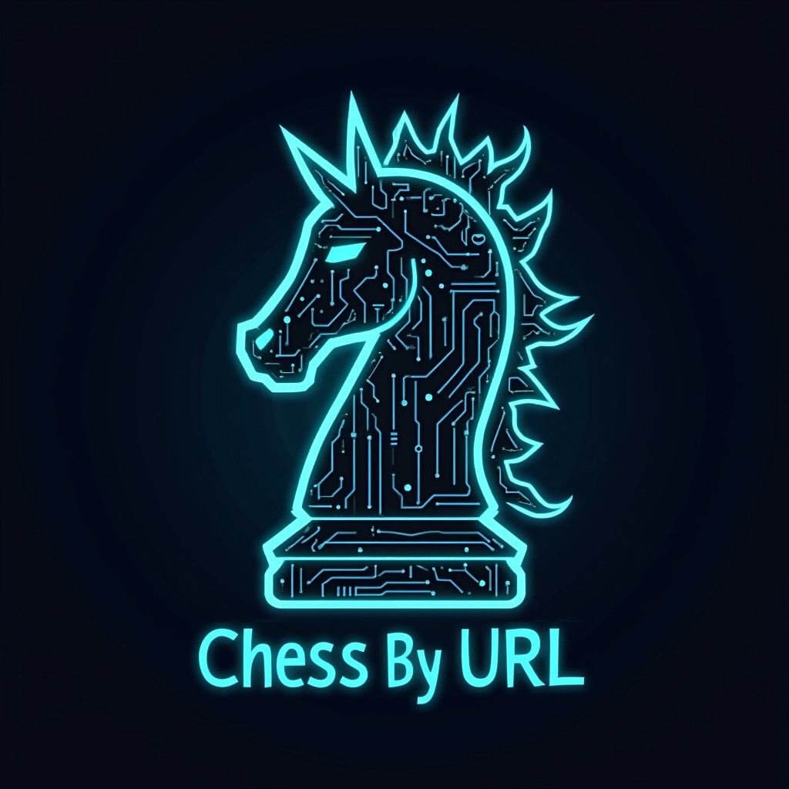

Chess By URL is a website that allows users to play chess or share chess puzzles by sharing URLs (via email, 
message boards, IM apps, etc). The URL contains the full state of the game, so players don't need to worry about 
user accounts, link expiry, etc.

Chess By URL was developed with the intention of eventually supporting chess variants, including non-standard layouts
and variants with fairy pieces, with the rulesets also embedded in the URLs. Currently, only standard chess is supported.

## Getting started
If you just want to play some chess, [visit the website here](https://chessbyurl.azurewebsites.net/).

If you want to run/develop the application yourself, you'll just need a development environment for .NET 9.0. This application 
is very light on dependencies, so after cloning the repository you should be able to just open the .sln file in 
Visual Studio 2022 Community (or similar) and run it.

## Roadmap
- [x] **Standard Chess ruleset**
- [x] **UI for playing the game**
- [x] **SVG board image generation**
- [ ] **[Chess960](https://en.wikipedia.org/wiki/Chess960) starting layouts:** Support generating Chess960 positions either 
                randomly or by number. This is almost ready, but castling rules need a bit more work (especially since some 
                layouts require user input to differentiate between moving and castling the King).
- [ ] **UI improvements:** There are several improvements that could be made to the UI, such as highlighting the last move
                and allowing drag-and-drop moves. It's probably not worth going too far with this since the client-side
                application (below) will replace it.
- [ ] **Board editor UI:** Allow users to edit the board layout and generate a URL for it. Once the rules are generalised
                enough to support Chess960, this will be a lot easier to implement.
- [ ] **Navigable move history:** Users should be able to view past board states, and choose to play from any of them.
- [ ] **Import/export:** Allow users to import/export board layouts (FEN) and move lists (PGN).
- [ ] **API:** Allow client/third-party applications to generate/interpret ChessByUrl URLs for their own purposes.
- [ ] **Caching:** This application is extremely cacheable. The board state is interpreted entirely from the URL, and
                intermediate board state calculations are useful for future calculations. A Redis cache or similar could
                make this application much faster.
- [ ] **Localisation:** Currently the application is only available in English. It would be nice to support other languages.
- [ ] **Accessibility:** The application is not very accessible to users who need I/O methods other than mouse/screen/touchscreen.
- [ ] **Client-side application:** Currently the application displays a server-generated web page with very simple 
                Javascript to select and navigate between moves. A client-side application would be a lot more responsive
                and allow for more fancy features. If it's written with Blazor WebAssembly, it could share the existing
                C# calculation logic, allowing for offline play and greatly easing the load on the server (we'd still want       
                to retain that logic on the server for generating SVGs).
- [ ] **[Chess On A Really Big Board](https://en.wikipedia.org/wiki/Chess_on_a_really_big_board) ruleset:** This is where
                we introduce fairy pieces and (hopefully) start seeing the Behaviour system shine.
- [ ] **Other rulesets:** Lots of different variants to research and implement. The application would probably need
                significant refactoring to support non-rectangular boards (e.g. hexagonal chess & 3D chess), but there
                are plenty of variants that just use a standard board.
- [ ] **Custom rulesets:** This is the end goal. Allow users to define their own rulesets and generate URLs for them. Allow
                users to mix-and-match pieces, and even define their own pieces, all embedded in the URL.

## Technical information
If you want to contribute or are just interested in how it works, see the [TECHNICAL.md](TECHNICAL.md) file.

## Contributing
Contributions are welcome! If you find a bug or have an idea for a feature, please open an issue. If you'd like to
make a minor change (fix up some styles, add emoji to this readme, etc.), feel free to make a pull request. For larger
changes, please open an issue first so we can discuss the best way to approach it.

I'm especially keen to hear from SVG artists who are willing to redesign the chess pieces and introduce new fairy pieces.

## Credits
Chess piece SVGs were sourced from [Wikimedia Commons](https://commons.wikimedia.org/wiki/Category:SVG_chess_pieces) and
are used under the [BSD 3-Clause License](ChessByUrl/wwwroot/images/LICENSE.txt).

## Licence
This project is licensed under the [MIT License](LICENSE.txt).
